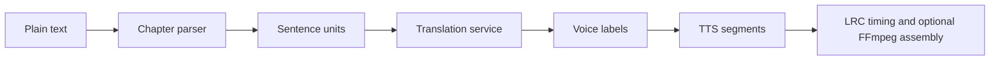

# AI-Dubbing-Pipeline

**A modular pipeline for long-form audiobook generation and temporally aligned video dubbing.**

AI-Dubbing-Pipeline is a research-oriented Python framework for converting multilingual text and subtitle-driven local video into English speech while preserving speaker structure, timing constraints, and audiovisual alignment. It is designed as an engineering portfolio: every core stage has a narrow interface, deterministic offline path, and lightweight tests.

The two workflows are:

1. Long-form text → translated multi-speaker audiobook segments with LRC timing.
2. Local video + subtitles → translated, temporally aligned English dubbing plan.

The video workflow operates only on local media supplied by the user. It does not include acquisition, scraping, or access-control bypass functionality.

## Why the problem is interesting

Text translation is only one part of a dubbed result. The system must maintain context across batches, detect structurally bad translations, preserve speaker labels, decide whether visually split subtitles form one utterance, handle TTS duration mismatch, and rebuild downstream timestamps after local video speed changes. This project isolates those decisions rather than hiding them in a single script.

## Architecture


### Audiobook pipeline



### Video dubbing pipeline


## Quick start: no model, GPU, or network required

```bash
python -m pip install -e '.[dev]'
pytest -q

python scripts/translate_srt.py \
  --input examples/sample_zh.srt \
  --translator mock \
  --output outputs/sample_en.srt

python scripts/dub_video.py \
  --input dummy/example.mp4 \
  --srt examples/sample_zh.srt \
  --tts mock \
  --dry-run

python scripts/build_audiobook.py \
  --input examples/sample_chapter.txt \
  --output-dir outputs/audiobook \
  --translator mock \
  --tts mock
```

The mock translator supplies deterministic English for the original synthetic examples. The mock TTS backend writes small tone-based WAV segments whose durations follow an explicit word-rate heuristic. It exists for testing the orchestration, not to represent speech quality.

## Core design choices

- `TranslationService` batches independent cues, supplies bounded context, checks response structure, and atomically saves valid progress after each batch. A changed input fingerprint invalidates stale progress.
- `TTSBackend` lets both workflows use the same synthesis contract. The core repository ships an offline mock. XTTS and Chatterbox are intentionally lazy integration boundaries, not bundled models.
- Subtitle grouping is deliberately conservative. A model-based boundary classifier can provide join decisions later; uncertain boundaries stay split.
- `fit_utterance_duration` first keeps base speech speed, then permits mild local slowdown, then raises TTS speed within a cap. If the hard limit is still exceeded, the plan records a warning for review rather than implying a perfect fit.
- `map_timestamp` and `remap_cues` use the same slowdown regions as the video planner, avoiding independent, drifting subtitle timing logic.

## Optional components

| Component | Needed for | Requirement |
| --- | --- | --- |
| Mock translator and TTS | Tests and demos | Nothing beyond Python 3.10 |
| YAML config reader | Loading `configs/*.yaml` | `pip install -e '.[config]'` |
| HTTP translation adapter | A deployed compatible service | Endpoint configuration; examples never call it |
| RapidOCR adapter | OCR from local frames | `pip install -e '.[ocr]'` |
| XTTS / Chatterbox adapters | Model-backed synthesis | Corresponding optional extra and model setup; GPU may be beneficial |
| FFmpeg | Segment assembly, mix, mux, or subtitle burn-in | A local FFmpeg installation on `PATH` |

Speaker embeddings and clustering are extension points and **experimental**. They are not presented as speaker-recognition results or accuracy claims.

## Repository layout

```text
ai_dubbing/
  audiobook/       chapter parsing, segment orchestration, LRC export
  common/          models, configuration, text and restart-safe IO
  speakers/        experimental embedding and clustering interfaces
  subtitles/       SRT, cleanup, grouping, OCR interface, alignment
  translation/     backend contract, prompts, normalization, QA, batching
  tts/             backend contract, offline mock, optional adapters, voices
  video/           duration fitting, timeline plan, FFmpeg mix and mux
configs/           conservative defaults
examples/          original synthetic text and subtitles
scripts/           directly runnable entry points
tests/             lightweight offline checks
```

See [the architecture notes](docs/ARCHITECTURE.md), [audiobook workflow](docs/AUDIOBOOK_PIPELINE.md), and [video workflow](docs/VIDEO_DUBBING_PIPELINE.md) for stage-level detail.

## Scope and limitations

- Inputs are user-provided text, subtitles, images, and local media; the repository includes no source media, subtitle corpus, reference audio, or generated results.
- Translation QA is structural and deterministic by default. Semantic review is a deployment-specific extension, not a claim of translation correctness.
- The supplied FFmpeg helpers build and run commands only for existing local files. Review generated media and subtitles before release.
- This is a research and engineering prototype, not a production service.

## License and reuse

No open-source license is granted for this repository at this time. The source is publicly visible for academic inspection, research discussion, and portfolio evaluation.

Third-party dependencies remain subject to their respective licenses.
