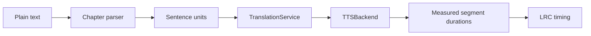

# AI-Dubbing-Pipeline

**A modular research pipeline for translation, speech synthesis, and temporal alignment.**

[](https://github.com/Zelong-G/AI-Dubbing-Pipeline/actions/workflows/ci.yml)


AI-Dubbing-Pipeline is a compact Python research/engineering framework for two related workflows:

1. **Long-form text → translated audiobook segments + LRC timing**
2. **Local video + subtitles → translated, temporally aligned dubbing plan**

The project focuses on system problems around multimodal dubbing rather than a particular foundation model: restart-safe translation, structural QA, conservative subtitle grouping, speaker/voice labels when available, speech-duration mismatch, local video slowdown, timeline remapping, and reviewed media export.

> **Scope.** Inputs are user-provided local text, subtitles, images, and media. This repository contains no copyrighted corpus, media acquisition logic, access-control bypass, model weights, reference voices, or private project assets.

## Why this problem is interesting

A translated sentence is not yet a usable dub. A practical system also has to decide whether translation jobs can resume safely, whether model output is structurally valid, whether visually split subtitles belong to one utterance, how to handle speech that exceeds the available time window, and how to keep subtitles synchronized after local video time warping.

## Architecture


### Audiobook path



### Video planning path


## Technical highlights

### Restart-safe translation

`TranslationService` batches cues by item and character limits, supplies bounded previous context, validates unique cue IDs, performs deterministic structural QA, and atomically caches only QA-valid rows. The cache stores both the backend name and an input fingerprint so stale translations are not silently reused.

### Model-independent speech boundary

The audiobook workflow uses a narrow `TTSBackend` protocol. `MockTTSBackend` writes deterministic tone-based WAV files so orchestration can be tested without a GPU or model download.

External synthesis systems can be connected through `CallableTTSAdapter`. Model loading, checkpoints, devices, reference-audio policy, and model-specific licensing remain outside this repository.

Video timing planning is separately typed against `SpeechDurationEstimator`. The included `HeuristicDurationEstimator` is transparent and offline; deployments can replace it with measured durations or a learned estimator.

### Temporal fitting policy

For each utterance the planner:

1. uses the original cue interval plus safe silence before the next cue;
2. keeps the base speech rate when possible;
3. allows bounded local video slowdown;
4. increases TTS speed only if the soft slowdown limit would otherwise be exceeded;
5. emits an explicit warning if the hard fitting limit still cannot be met.

The resulting `SlowRegion` objects define one source-to-output time map. The same mapping is reused for subtitle remapping so audio/video and subtitle timing do not drift independently.

## Quick start — no GPU, model, media, or network required

```bash
git clone https://github.com/Zelong-G/AI-Dubbing-Pipeline.git
cd AI-Dubbing-Pipeline

python -m venv .venv
source .venv/bin/activate
python -m pip install --upgrade pip
python -m pip install -e ".[dev]"
```

Run the public verification path:

```bash
pytest -q
python -m compileall ai_dubbing scripts

python scripts/translate_srt.py \
  --input examples/sample_zh.srt \
  --translator mock \
  --output outputs/sample_en.srt

python scripts/dub_video.py \
  --input dummy/example.mp4 \
  --srt examples/sample_zh.srt \
  --dry-run

python scripts/build_audiobook.py \
  --input examples/sample_chapter.txt \
  --output-dir outputs/audiobook \
  --translator mock \
  --tts mock
```

The dry-run video command deliberately does not open the dummy video path. It exercises SRT parsing, grouping, translation, QA, voice-label assignment, duration estimation, fitting, and timeline construction.

The current suite contains **9 offline unit tests**. GitHub Actions also installs the package, runs lint/compile checks, and executes all three public demos on Python 3.10 and 3.12.

## Public interfaces

| Interface | Purpose |
| --- | --- |
| `TranslationBackend` | Provider-neutral translation |
| `TranslationService` | Batching, context, QA, cache/restart |
| `TTSBackend` | Speech synthesis contract |
| `CallableTTSAdapter` | Wrap externally managed synthesis code |
| `SpeechDurationEstimator` | Decouple video planning from a TTS model |
| `SubtitleOCR` | Optional OCR contract for local frame images |
| `FitPolicy` | Explicit duration-fitting constraints |
| `map_timestamp` | Shared source-to-output timeline mapping |

## Optional components

| Component | Status |
| --- | --- |
| YAML configuration | Optional via `.[config]` |
| RapidOCR | Optional local-frame integration via `.[ocr]` |
| External TTS models | Connect through `TTSBackend` / `CallableTTSAdapter`; no model-specific wrapper is claimed |
| Speaker embeddings/clustering | Experimental extension interfaces only |
| FFmpeg | Required only for real local-media assembly/mixing/muxing |

## Repository layout

```text
ai_dubbing/
  audiobook/       chapter parsing, synthesis orchestration, LRC export
  common/          serializable models, configuration, text and atomic IO
  speakers/        experimental embedding/clustering interfaces
  subtitles/       SRT, cleanup, grouping, OCR contract, alignment
  translation/     backend contract, prompts, QA, normalization, batching/cache
  tts/             TTS contract, generic adapter, mock backend, duration estimate
  video/           duration fitting, timeline plan, FFmpeg command/export helpers
configs/           conservative reference defaults
examples/          original synthetic text and subtitles
scripts/           runnable public entry points
tests/             lightweight offline tests
docs/              architecture and workflow notes
```

See [Architecture](docs/ARCHITECTURE.md), [Audiobook workflow](docs/AUDIOBOOK_PIPELINE.md), and [Video dubbing workflow](docs/VIDEO_DUBBING_PIPELINE.md).

## Limitations

- Structural translation QA catches malformed or obviously unusable output; it is not a semantic quality metric.
- The public text parser does not automatically identify novel characters or dialogue speakers.
- Speaker embedding/clustering is an experimental interface, not a published recognition result.
- The repository does not ship model-specific TTS weights or a ready-to-run XTTS/Chatterbox wrapper.
- Real dubbing still requires reviewed local media, a chosen synthesis implementation, and FFmpeg for final assembly.
- This is a research/engineering prototype, not a production service.

## Third-party software

No third-party source, model weights, datasets, or media assets are vendored. See [THIRD_PARTY.md](THIRD_PARTY.md).

## Citation

If the software is useful in academic work, citation metadata is provided in [CITATION.cff](CITATION.cff).

## Author

**Zelong Zheng**  
Technical University of Munich (TUM)

Research interests: multimodal AI, computer vision, autonomous driving, and research engineering.

GitHub: [Zelong-G](https://github.com/Zelong-G)

## License and reuse

No open-source license is granted for this repository at this time. The source is publicly visible for academic inspection, research discussion, and portfolio evaluation.

Third-party dependencies remain governed by their respective licenses.
